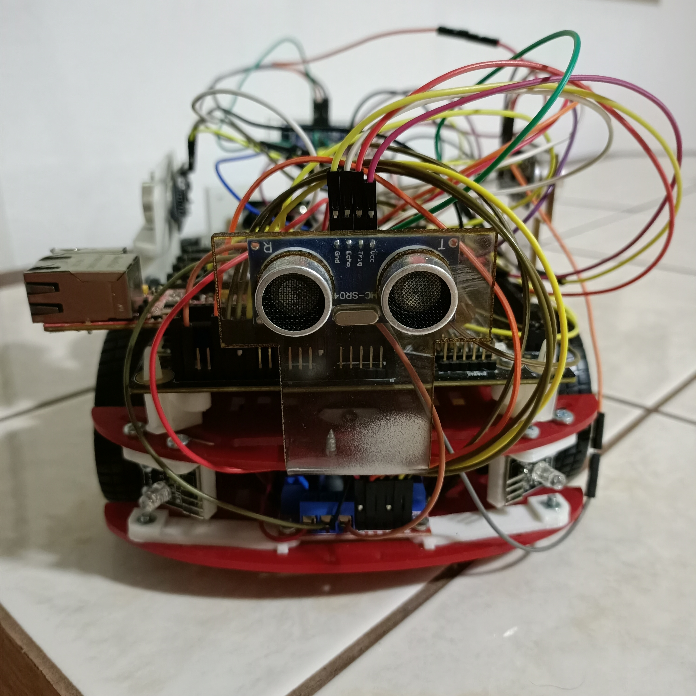
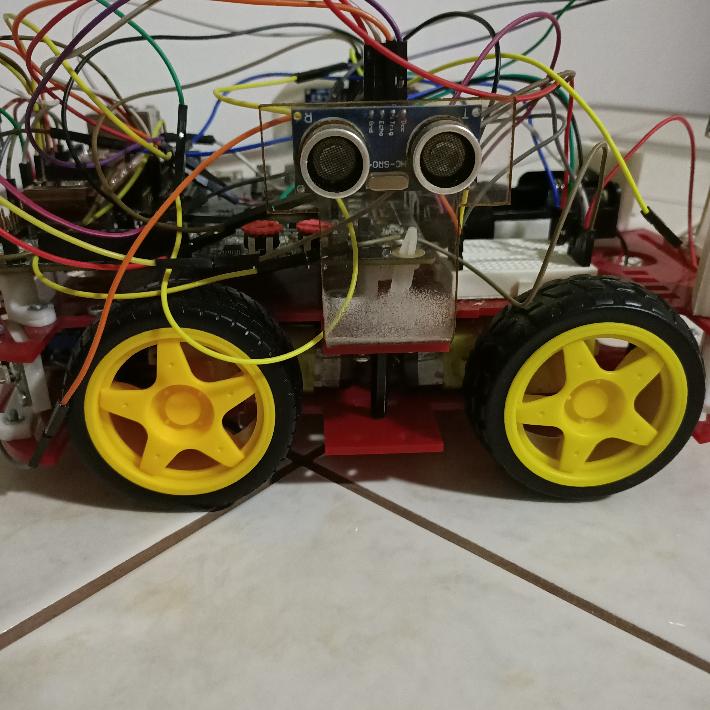
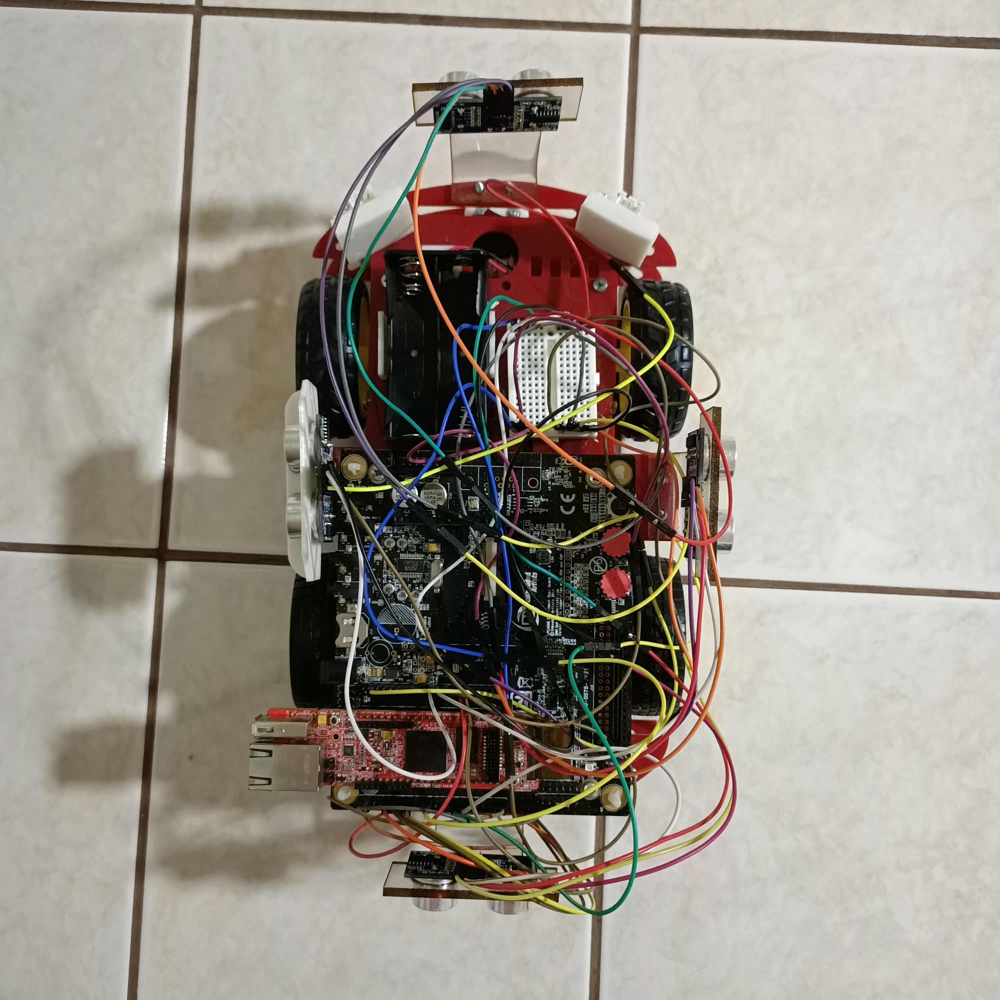

# Autonomous Car

This repository is for our CmpE492 Senior Project. We developed an autonomous car using LPC4088 MCU whose task is to follow the walls of a room in clockwise direction. The car has 4 ultrasonic sensors which are on the front, left, right and back sides of the car. It has 4 wheels controlled in two groups.

  

The image on the left shows one of its sensors. We used HC-SR04 ultrasonic sensors and included their user manual below. The image in the middle shows the wheels on one side of the car. The image on the right shows the placement of the 4 sensors on the car.

## Presentation & Poster

Video Presentation: [CMPE492_Presentation](https://drive.google.com/file/d/1v7ZnOM-T5GGkCR1SXHG1gKKqD3_v4xwR/view)  
Poster: [CMPE492_Poster](https://drive.google.com/file/d/1pslk-dO6079LEf0nyMtstPSZ7mlsOaZ4/view)  
Navigation Video for MLP Model: [Navigation_Video](https://drive.google.com/file/d/143ThXZ1jeqi1DZZFkX0uSGN1uQVC05_P/view)

## How to Run

### Autonomous Car

To run the project on car or simulator:

1. Download and install [Keil uVision IDE](https://www.keil.com/download/product/) (MDK-Arm)
1. Download or clone the repository: [autonomous-car](https://github.com/sercanersoy/autonomous-car.git)
1. Open the project using Keil uVision
1. Run simulation or flash download to car

If you want to run on the car, make sure to:

1. Connect the car to the computer using a Micro-B type USB cable
1. Connect right pins according to Pin Configurations below
1. Connect sensors and motor driver to voltage

You can change the macro definition in the beginning of the _main.c_ file to update the operation mode. There are 4 modes:

1. **TEST:**
	- Ultrasonic sensors can be tested. If the sensor reading is smaller than 15 centimeters, corresponding LED on the Quickstart Board will be turned off.
	- Actions can be tested. Press user push button on the Quickstart Board to take each action one by one.
1. **MLP:**
	- Press user push button on the Quickstart Board to start autonomous navigation using MLP model.
	- Press it again to stop the navigation.
1. **SVM:**
	- Press user push button on the Quickstart Board to start autonomous navigation using SVM model.
	- Press it again to stop the navigation.
1. **DT:**
	- Press user push button on the Quickstart Board to start autonomous navigation using DT model.
	- Press it again to stop the navigation.

Each model is implemented in a separate file. You can check and modify them as you like:

1. **Multilayer Perceptron (MLP):** _mlp.c_ and _mlp.h_
1. **Support Vector Machine (SVM):** _svm.c_ and _svm.h_
1. **Decision Tree (DT):** _decision_tree.c_ and _decision_tree.h_

You can modify the car's actions by updating below macros in _action.c_ file:

1. **ACTION_FORWARD_MICROSECOND:** Determines how many microseconds the car will go forward for action `Move-Forward` and after taking turns.
1. **ACTION_SHARP_MICROSECOND:** Determines how many microseconds the car will turn for action `Sharp-Right-Turn`.
1. **ACTION_SLIGHT_MICROSECOND:** Determines how many microseconds the car will turn for actions `Slight-Right-Turn` and `Slight-Left-Turn`.
1. **ACTION_FORWARD_SPEED:** Determines the motor PWM duty cycle when moving forward for action `Move-Forward` or after taking turns.
1. **ACTION_TURN_SPEED:** Determines the motor PWM duty cycle when turning for actions `Sharp-Right-Turn`, `Slight-Right-Turn`, and `Slight-Left-Turn`.

### Jupyter Notebook

You can run the Jupyter Notebook using:

```
cd path-to-project/autonomous-car
jupyter notebook .
```

If you want to detach the process from the terminal:

```
cd path-to-project/autonomous-car
nohup jupyter notebook . &> /dev/null &
```

## Pin Configurations

### Timer

#### Ultrasonic Sensor 0

- **Trigger** - T3_MAT_2 - P5.2 - P32
- **Echo** - T3_CAP_0 - P0.23 - P15

#### Ultrasonic Sensor 1

- **Trigger** - T2_MAT_3 - P0.9 - P11
- **Echo** - T2_CAP_0 - P0.4 - P34

#### Ultrasonic Sensor 2

- **Trigger** - T2_MAT_3 - P0.9 - P11
- **Echo** - T2_CAP_1 - P0.5 - P33

#### Ultrasonic Sensor 3

- **Trigger** - T3_MAT_2 - P5.2 - P32
- **Echo** - T3_CAP_1 - P0.24 - P16

### PWM

#### Motor Driver

- **ENA** - PWM0_1 - P1.2 - P30
- **ENB** - PWM0_2 - P1.3 - P29

### GPIO

#### Motor Driver

- **IN1** - P1.24 - P5
- **IN2** - P1.23 - P6
- **IN3** - P1.20 - P7
- **IN4** - P0.21 - P8

## User Manuals

- [UM10562 LPC408x/407x User Manual](https://www.nxp.com/docs/en/user-guide/UM10562.pdf)
- [LPC4088 QuickStart Board revA](https://os.mbed.com/media/uploads/flirflashlight/lpc4088_quickstart_board_rev_a.pdf)
- [LPC4088 Experiment Base Board revA](https://www.embeddedartists.com/wp-content/uploads/2018/06/LPC4088_Experiment_Base_Board_revA.pdf)
- [HC-SR04 Ultrasonic Sensor User Manual](https://cdn.sparkfun.com/datasheets/Sensors/Proximity/HCSR04.pdf)
- [L298N Motor Driver Manual](http://www.handsontec.com/dataspecs/L298N%20Motor%20Driver.pdf)

## Articles Read

- [Autonomous navigation research for mobile robot](https://ieeexplore.ieee.org/document/6357893)
- [Autonomous mobile robot navigation using machine learning](https://ieeexplore.ieee.org/document/6419894)
- [Multi-ultrasonic sensor fusion for autonomous mobile robots](http://www8.cs.umu.se/research/ifor/dl/Sensors/Multi-ultrasonic%20sensor%20fusion%20for%20autonomous%20mobile%20robots.pdf)
- [How to Use Multiple Ultrasonic Sensors](https://www.maxbotix.com/tutorials1/031-using-multiple-ultrasonic-sensors.htm)
